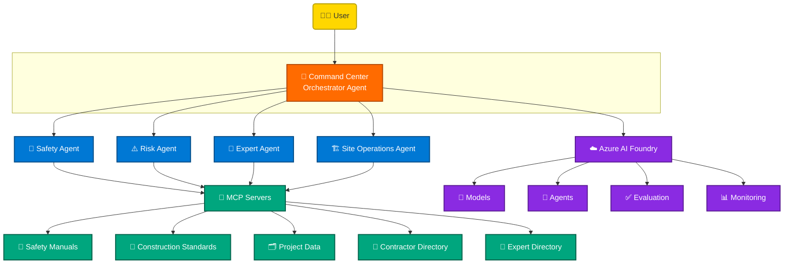

# 🏗️ Build an AI-Powered Construction Command Center

### Using GitHub Copilot and Azure AI Foundry

🏆 **LTM GitHub Copilot Innovation Challenge**

## 🚧 MegaBuild Command Center

*Enterprise Multi-Agent Construction Operations Challenge*

---

## 📑 Table of Contents

- [🧩 Business Scenario](#-business-scenario)
- [🎯 Challenge Objective](#-challenge-objective)
- [🤖 Required Agent Ecosystem](#-required-agent-ecosystem)
- [🧭 Recommended Architecture](#-recommended-architecture)
- [🔌 Suggested MCP Context Sources](#-suggested-mcp-context-sources)
- [📦 Innovation Challenge Deliverables](#-innovation-challenge-deliverables)
- [🗂️ Challenge Tasks](#️-challenge-tasks)
- [🏆 Leaderboard Scoring](#-leaderboard-scoring)
- [✅ Definition of Done](#-definition-of-done)

---

## 🧩 Business Scenario

MegaBuild Constructions is building a new international airport terminal.

The project spans multiple construction zones, contractors, suppliers, architects, safety inspectors, and project managers.

Every day, teams must answer questions such as:

- ⏱️ What activities are delayed?
- 🚨 What safety incidents require attention?
- ⚠️ Which construction risks could impact project completion?
- 👷 Which contractor owns an issue?
- 📋 What inspections are pending?
- 🧠 Who is the best expert to help resolve a structural problem?
- 🎯 What actions should be prioritized today?

Currently, information is spread across project reports, inspection documents, schedules, safety manuals, contractor records, and knowledge bases.

> [!IMPORTANT]
> Leadership wants an **AI-powered Construction Command Center** that can reason across multiple information sources and coordinate specialized AI agents to deliver timely, actionable insights.

## 🎯 Challenge Objective

Design and build an enterprise AI agent ecosystem that helps construction teams:

- 🔍 Discover project information
- 🕵️ Investigate site issues
- ⚠️ Identify risks
- 🧠 Find subject matter experts
- 🩹 Recommend mitigation actions
- 📊 Summarize construction status
- 🔗 Coordinate information across multiple specialized agents

The solution must demonstrate modern AI engineering practices using:

| 🛠️ Practice | 🛠️ Practice |
| --- | --- |
| 💬 GitHub Copilot Chat | 🧠 Custom Instructions |
| 🤖 GitHub Copilot Coding Agent | 📄 Prompt Files |
| 🧩 Skills | 🔌 MCP (Model Context Protocol) |
| ☁️ Azure AI Foundry | 🕸️ Agent Framework |
| 🔀 Multi-Agent Orchestration | 🛡️ Hooks and Quality Gates |
| ✅ Agent Evaluation and Testing | |

## 🤖 Required Agent Ecosystem

Every team must build the following agents.

### 🏗️ Site Operations Agent

**Responsible for:**

- 📌 Project status lookup
- 🗓️ Schedule review
- 🚩 Milestone tracking
- 📈 Site progress summaries

> 💬 *"What activities are delayed in Terminal A?"*
> 💬 *"Which milestones are due this week?"*

### 🦺 Safety Compliance Agent

**Responsible for:**

- 📜 Safety regulations
- 🚨 Incident review
- 🔎 Inspection guidance
- ⚠️ Hazard recommendations

> 💬 *"What actions are required after a scaffolding safety incident?"*
> 💬 *"What PPE is required for working at height?"*

### 🧠 Construction Expert Agent

**Responsible for:**

- 🧑‍🔬 Identifying specialists
- 🌟 Recommending experts
- 📚 Locating previous project experience

> 💬 *"Who can help investigate structural concrete cracking?"*
> 💬 *"Which team has experience with runway drainage systems?"*

### ⚠️ Risk Analysis Agent

**Responsible for:**

- 🕵️ Identifying risks
- 📉 Predicting schedule impacts
- 🩹 Recommending mitigations
- 📢 Escalation recommendations

> 💬 *"What risks could delay Terminal B completion?"*
> 💬 *"Which risks should leadership review today?"*

### 🎯 Command Center Orchestrator Agent

**Responsible for:**

- 📥 Receiving user requests
- 🔀 Routing requests to specialized agents
- 🧵 Combining responses
- 📤 Producing a final answer

> [!NOTE]
> **Example:** *"We discovered water leakage in the basement. What should we do?"*

The orchestrator should:

1. ⚠️ Query the Risk Agent.
2. 🦺 Query the Safety Agent.
3. 🧠 Query the Expert Agent.
4. 🏗️ Query the Site Operations Agent.
5. 📤 Generate a consolidated response.

## 🧭 Recommended Architecture

## 🔌 Suggested MCP Context Sources

Each team should expose project context through MCP.

Examples include:

| | | |
| --- | --- | --- |
| 📐 Construction standards | 📘 Safety manuals | 🏛️ Building codes |
| 🗓️ Project schedules | 👷 Contractor directory | 🗒️ Site issue logs |
| 📖 Construction glossary | 🌟 Expert directory | 🎓 Lessons learned repository |

## 📦 Innovation Challenge Deliverables

> [!TIP]
> Teams should focus on building an **intelligent agent solution** rather than a traditional CRUD application.

The emphasis is:

🧠 Agent Design · 🤝 Agent Collaboration · 💡 AI Reasoning · 🔌 MCP Integration · ☁️ Foundry Usage · 💻 GitHub Copilot Assisted Development

## 🗂️ Challenge Tasks

> [!NOTE]
> Each task below is collapsible — click a task header to expand its details. ✨

<b>🧭 Task 1: Business Scenario, Personas, and Agent Architecture</b>

**🎯 Objective:** Define the Construction Command Center solution.

**Activities:**

- Define business goals
- Define user personas
- Identify agent responsibilities
- Design orchestration flow
- Create architecture diagram
- Identify MCP context sources

**💬 GitHub Copilot focus:** Use GitHub Copilot Chat to:

- Generate architecture alternatives
- Explore agent patterns
- Refine solution scope

**📦 Deliverables:**

- `architecture.md`
- `personas.md`
- `solution-overview.md`

<b>📝 Task 2: GitHub Copilot Instructions, Prompts, Skills, and Agent Personas</b>

**🎯 Objective:** Create reusable GitHub Copilot assets.

**Activities:**

#### 📐 Instructions

Examples:

- Agent development standards
- Prompt design standards
- Testing standards
- Security standards

#### 📄 Prompt Files

Create a minimum of five:

- `create-agent.prompt.md`
- `create-tool.prompt.md`
- `evaluate-agent.prompt.md`
- `generate-tests.prompt.md`
- `review-agent.prompt.md`

#### 🧩 Skills

Create a minimum of three:

- Agent Architect
- Prompt Engineer
- Evaluation Specialist

#### 🎭 Agent Personas

Document each agent's role, goals, tools, and expected outputs.

**💬 GitHub Copilot focus:** Demonstrate:

- Custom Instructions
- Prompt Files
- Skills

<b>☁️ Task 3: Create Azure AI Foundry Project</b>

**🎯 Objective:** Create the AI development environment.

**Activities:**

- Create Foundry Project
- Configure model
- Configure agent environment
- Document setup

**📦 Deliverables:**

- `foundry-setup.md`
- Project screenshots

**💬 GitHub Copilot focus:** Use Copilot to generate setup guidance and validation steps.

<b>🏗️ Task 4: Build the Site Operations Agent</b>

**🎯 Objective:** Implement the first specialized agent.

**Activities:**

- Define system prompt
- Create tools
- Add project schedule context
- Add project status retrieval capability

**💬 GitHub Copilot focus:** Use Coding Agent to generate:

- Agent scaffolding
- Prompts
- Evaluation scenarios

<b>🦺 Task 5: Build the Safety Compliance Agent</b>

**🎯 Objective:** Create a safety-focused agent.

**Activities:**

- Connect safety context
- Create inspection workflows
- Generate safety recommendations

**💬 GitHub Copilot focus:** Use Copilot Chat and Coding Agent for iterative development.

<b>🧠 Task 6: Build the Construction Expert Agent and Risk Agent</b>

**🎯 Objective:** Create expert discovery and risk analysis capabilities.

**Activities:**

- Expert lookup
- Risk identification
- Impact analysis
- Mitigation recommendations

**💬 GitHub Copilot focus:** Use multi-file agent development workflows.

<b>🔌 Task 7: Build an MCP Server</b>

**🎯 Objective:** Provide external context to agents.

**Activities:** Create or configure MCP to expose:

- Contractor directory
- Expert directory
- Construction glossary
- Safety documentation
- Sample project records

**💬 GitHub Copilot focus:** Demonstrate:

- MCP configuration
- Tool discovery
- Context grounding

<b>🔀 Task 8: Implement Multi-Agent Orchestration Using Agent Framework</b>

**🎯 Objective:** Create the Command Center Orchestrator.

**Activities:** Implement:

- Agent routing
- Agent handoff pattern
- Response aggregation
- Multi-agent workflows

**💬 GitHub Copilot focus:** Use Coding Agent to implement orchestration across multiple files.

<b>✅ Task 9: Agent Evaluation and Testing</b>

**🎯 Objective:** Validate solution quality.

**Activities:** Create evaluations for:

- Accuracy
- Hallucination reduction
- Tool grounding
- Agent routing correctness
- Response quality

**📦 Deliverables:**

- `evaluation-plan.md`
- `test-results.md`

**💬 GitHub Copilot focus:** Use Copilot to generate evaluation cases and test scenarios.

<b>🚀 Task 10: Use GitHub Copilot Coding Agent for an End-to-End Feature</b>

**🎯 Objective:** Complete a feature using Agent Mode.

**Examples:**

- Incident Investigation Workflow
- Delayed Activity Analysis
- Contractor Escalation Workflow
- Safety Inspection Assistant

The feature must include:

- Prompt updates
- Agent changes
- Tool changes
- Tests
- Documentation

**💬 GitHub Copilot focus:** Demonstrate Coding Agent planning and implementation.

<b>🛡️ Task 11: Hooks, Quality Gates, and Automation</b>

**🎯 Objective:** Ensure production-quality development practices.

**Activities:** Implement:

- Prompt validation checks
- Agent configuration checks
- Test execution
- Quality gates
- Local hooks

**📦 Deliverables:**

- Automation scripts
- Quality checklist

<b>🎤 Task 12: Executive Demo and Final Showcase</b>

**🎯 Objective:** Demonstrate a complete Construction Command Center experience.

**Required demo scenario:** A project manager asks:

> [!IMPORTANT]
> *"Heavy rains have delayed runway excavation and water leakage has been reported near Terminal B. What should we do?"*

The solution should demonstrate:

1. 📥 The Orchestrator receives the request.
2. 🏗️ The Site Operations Agent reviews schedules.
3. ⚠️ The Risk Agent analyzes project impact.
4. 🦺 The Safety Agent reviews compliance requirements.
5. 🧠 The Expert Agent identifies specialists.
6. 📤 The Orchestrator produces a consolidated action plan.

---

## 🏆 Leaderboard Scoring

| Category | Points | Weight |
| --- | :---: | --- |
| 💬 GitHub Copilot Usage | **15** | 🟧🟧🟧 |
| 📝 Prompt Engineering | **10** | 🟨🟨 |
| 🧩 Skills and Instructions | **10** | 🟨🟨 |
| 🤖 Agent Design | **15** | 🟧🟧🟧 |
| 🔗 Agent Framework Usage | **15** | 🟧🟧🟧 |
| 🔌 MCP Integration | **15** | 🟧🟧🟧 |
| ☁️ Azure AI Foundry Usage | **10** | 🟨🟨 |
| ✅ Evaluation and Testing | **5** | 🟩 |
| 🎤 Demo and Documentation | **5** | 🟩 |
| **🏁 Total** | **100** | |

## ✅ Definition of Done

A team is considered successful when:

- [x] All mandatory tasks are approved.
- [x] Azure AI Foundry is used.
- [x] At least four specialized agents are implemented.
- [x] MCP is integrated.
- [x] Agent Framework orchestration is demonstrated.
- [x] GitHub Copilot Instructions, Prompts, Skills, Agents, MCP, and Hooks are visible in the solution.
- [x] Evaluation results are documented.
- [x] The executive demo scenario runs successfully end-to-end.

---

### 🚀 Ready to build the future of construction operations? Let's go! 🏗️✨

- The executive demo scenario runs successfully end-to-end.
